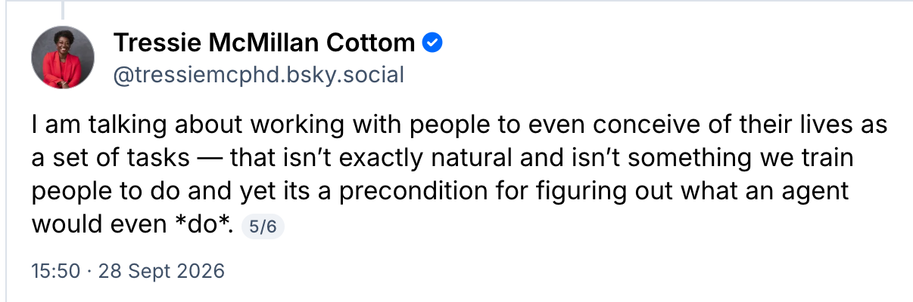

Came across this post by [Tressie McMillan Cottom](https://bsky.app/profile/tressiemcphd.bsky.social) (and related posts on the topic, [here](https://bsky.app/profile/tressiemcphd.bsky.social/post/3mwll5j6xq22v) and [here](https://bsky.app/profile/tressiemcphd.bsky.social/post/3mwnsiyaybs2k)) on how one of the problems with AI (and well AI Agents in particular).

A few thoughts …
1. She's not wrong (people don't think of their lives as a bunch of tasks)
2. This is a product problem (I have a theory that all tech problems are product problems really)

We've had workflows and task automation for forever now. How many people even use gMail or Outlook filters/rules? (For example). The reality is people are messy (generally) and being organised is both difficult and complex but also takes effort to organise. 

The _theory_ of AI an agents is agents take the heavy lifting off you. ”Hey agent, go get all my emails about the school and out them in my calendar, etc.”

But the reality is two fold.
1. It's not that easy to get the agents to do exactly what you want in the right way
2. As TMC says in her posts, people just don't think like this.

I do think, (1) will get easier. I'm not sold that (2) will change much. It's certainly making the "ok I don't need to set up a gmail filter I can just tell gmail what I want" step easier.

But I'm not sure it's making the "I know what I want the outcome to be" step easier.

Which is about the product, not the tech.

And the wider tech here (Copilot normal, Gemini in gMail, Siri on iPhones etc) isn't there (yet? ever?). Partly because the user bases are so big, they need to be careful, partly because the general models for the general public aren't the best models, and partly because it's hard making a product for 1b people (because people are people and people don't think of their lives as a set of tasks, go read the other posts by TMC I linked too, or just the general chat around the posts)

I think, the models will get better faster than the other two points above. The really question is can the models and the product get so good that people change to use them more. I'm not so sure.

But I do think both this is one of those things where "we over estimate the impact in 1 year and under estimate it in 10 years" and productivity workflows is more niche than tech and product people think. 

There also is a cognitive cost to managing workflows and agents. But thats for a later thought.
